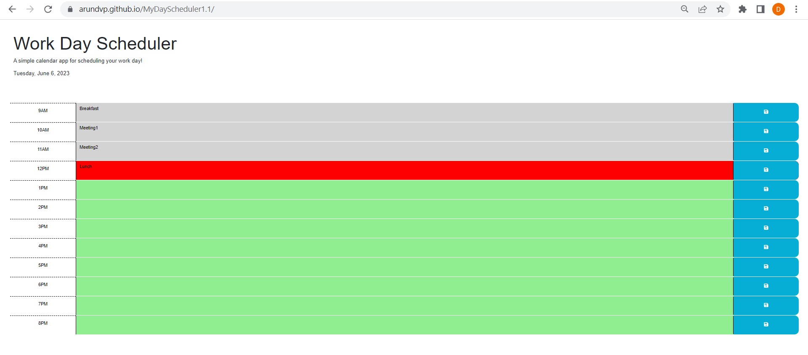

# Work Day Scheduler

## Objective:

Create a simple calendar application that allows a user to save events for each hour of the day by modifying starter code. This app will run in the browser and feature dynamically updated HTML and CSS powered by jQuery.
Need to use the Day.js library to work with date and time.

## User Story: 

AS AN employee with a busy schedule
I WANT to add important events to a daily planner
SO THAT I can manage my time effectively

## Summary of the Code 

This code sets the current date in the header, handles click events on save buttons to store user input in the browser's local storage, applies classes to time block elements based on the current hour, and retrieves and sets.

Logic:

This code is written using jQuery and executes when the document is ready. Let's break it down step by step:

1. `$(document).ready(function() { ... });`: This code wraps the entire script and ensures that it executes only when the DOM is fully loaded and ready.

2. `var currentDate = dayjs().format("dddd, MMMM D, YYYY");`: This line uses the `dayjs` library (similar to Moment.js) to get the current date and format it as "dddd, MMMM D, YYYY". The result is stored in the `currentDate` variable.

3. `$("#currentDay").text(currentDate);`: This line sets the text content of the element with the `id` "currentDay" to the value of `currentDate`. It updates the header to display the current date.

4. `$(".save-btn").on("click", function() { ... });`: This code adds a click event listener to all elements with the class "save-btn". When a save button is clicked, the callback function is executed.

   - `var timeBlockId = $(this).parent().attr("id");`: This line retrieves the ID of the parent element of the clicked button and stores it in the `timeBlockId` variable.
   - `var userInput = $(this).siblings(".description").val();`: This line gets the value of the input field with the class "description" that is a sibling of the clicked button and stores it in the `userInput` variable.
   - `localStorage.setItem(timeBlockId, userInput);`: This line uses the `localStorage` API to save the `userInput` value in the browser's storage, associated with the `timeBlockId`.

5. `$(".time-block").each(function() { ... });`: This code iterates over all elements with the class "time-block" and executes the callback function for each element.

   - `var timeBlockId = $(this).attr("id");`: This line retrieves the ID of the current time block element and stores it in the `timeBlockId` variable.
   - `var currentHour = dayjs().hour();`: This line gets the current hour using `dayjs` and stores it in the `currentHour` variable.
   - `var blockHour = parseInt(timeBlockId.split("-")[1]);`: This line extracts the hour value from the `timeBlockId` by splitting it at the "-" character and parsing it as an integer, storing it in the `blockHour` variable.

   The following conditional statements apply the appropriate class to each time block element based on the comparison between `blockHour` and `currentHour`. The classes "past", "present", or "future" are added or removed accordingly.

6. `$(".time-block").each(function() { ... });`: This code iterates over all elements with the class "time-block" again.

   - `var timeBlockId = $(this).attr("id");`: This line retrieves the ID of the current time block element and stores it in the `timeBlockId` variable.
   - `var userInput = localStorage.getItem(timeBlockId);`: This line retrieves the corresponding value from the `localStorage` associated with the `timeBlockId` and stores it in the `userInput` variable.

   If there is a value stored in `localStorage` for the `timeBlockId`, it sets the value of the input field with the class "description" inside the current time block element to the `userInput` value.

## Tasks Completed: 

Created the GIT repository named MyDayScheduler1.1

Pushed the code the repository MyDayScheduler1.1

Hosted the index.html in GitHub Pages

## Links

URL to my deployed webpage: https://arundvp.github.io/MyDayScheduler1.1/

URL to the GitHub repository: https://github.com/arundvp/MyDayScheduler1.1

